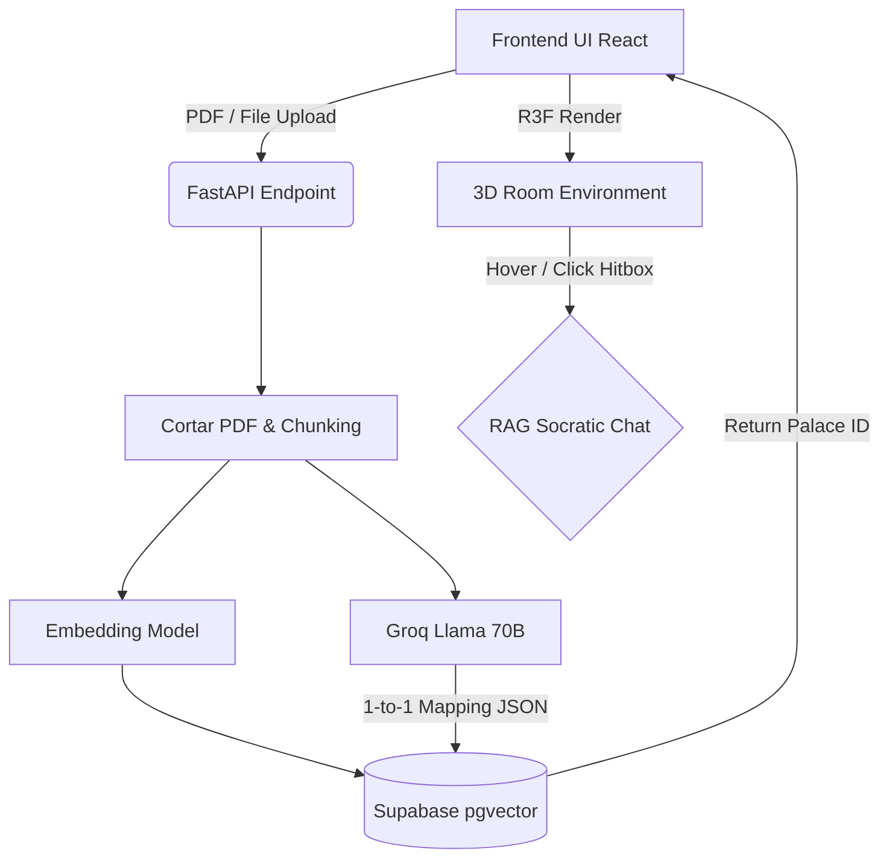

# neuralhome
NeuralHome no es una aplicación de estudio tradicional; es una Interfaz de Navegación del Conocimiento. Nuestra tesis es que el cerebro humano no evolucionó para leer listas de texto plano, sino para navegar espacios físicos. Estamos construyendo una plataforma que usa IA para transformar documentos pasivos PDFs en Palacios Mentales 3D dinámicos

<div align="center">


<h1 align="center">NeuralHome 🧠🏰</h1>
<p align="center">
<strong>Transforma documentos aburridos en Palacios Mentales 3D inmersivos.</strong>
</p>
</div>

## 📌 Project Name and Description

**NeuralHome** es una aplicación innovadora de _Espacio Mental 3D_ (Mind Palace) que mejora drásticamente la retención de la memoria convirtiendo el material de estudio en entornos espaciales estructurados.

La aplicación utiliza un pipeline **RAG (Retrieval-Augmented Generation)** impulsado por Inteligencia Artificial para extraer los conceptos clave de un documento PDF. Luego, mapea lógicamente estos conceptos hacia "Anclas" físicas dentro de un motor espacial 3D en el navegador interactuable. Ya basta de leer muros de texto: ahora podrás "caminar" por tu propio conocimiento.

---

## 💻 Technology Stack

NeuralHome utiliza una arquitectura moderna orientada al rendimiento gráfico y procesamiento de IA nativo:

### Frontend
- **React 18** (vía Vite) - Framework UI.
- **Three.js** (`@react-three/fiber`, `@react-three/drei`) - Motor WebGL para renderizado 3D.
- **Vanilla CSS** con variables - Diseño responsivo con foco en estéticas Glassmorphism / Cyberpunk.
- **Supabase JS Client** - Para autenticación nativa y consultas rápidas RPC.
- **Zustand / Context API** - Manejo de estados inmersivos.

### Backend (Inteligencia & Procesamiento)
- **FastAPI (Python 3.10+)** - Framework robusto y asíncrono para el manejo de APIs.
- **PyMuPDF (`fitz`)** - Lector de streams PDF hiperrápido de bajo peso en memoria.
- **SentenceTransformers** (`BAAI/bge-small-en-v1.5` en HF) - Generación de vector embeddings hugging face para RAG.
- **Groq API** - Host de los modelos LLM súper rápidos:
- `Llama-3.1-8b-instant`: Para el **Neural Architect** Socrático.
- `Llama-3.3-70b-versatile`: Para el Mapeo Lógico 1-a-1 de *Spatial Anchoring*.

### Database & Auth
- **Supabase (PostgreSQL)** - Base de datos principal.
- **PostGIS / pgvector** - Para el almacenamiento semántico indexado.
- **Row Level Security (RLS)** - Seguridad controlada nativamente en la infraestructura.

---

## 🏗 Project Architecture

La arquitectura RAG de NeuralHome y WebGL obedece un modelo de Separación Fuerte bajo eventos síncronos:



El flujo principal asegura la inmutabilidad de la estructura 3D al forzar vía ingeniería de prompts a la Inteligencia Artificial a no alucinar más conocimiento físico que los espacios (*Anclas*) disponibles hardcodeados en los cuartos.

---

## 🚀 Getting Started

Sigue estos pasos para arrancar el ecosistema en desarrollo local.

### Prerequisitos
- Node.js LTS (v18+)
- Python 3.10+
- Proyecto activo en Supabase
- API Key de Groq y Hugging Face.

### Instalación del Backend (Terminal 1)
```bash
cd backend
python -m venv venv
# Activar entorno (Windows: venv\Scripts\activate | Mac/Linux: source venv/bin/activate)
pip install -r requirements.txt
```
> Configura tu `.env` dentro de `backend/` con las variables `SUPABASE_URL`, `SUPABASE_KEY` (Anon), `GROQ_API_KEY`, `HUGGINGFACE_API_KEY`.
```bash
uvicorn app.main:app --reload --port 8001
```

### Instalación del Frontend (Terminal 2)
```bash
cd frontend
npm install
```
> Configura tu `.env` dentro de `frontend/` agregando `VITE_SUPABASE_URL` y `VITE_SUPABASE_ANON_KEY`.
```bash
npm run dev
```

---

## 📁 Project Structure

La organización general se distribuye entre Cliente y Servicio:

```
neuralhome/
├── backend/
│   ├── app/
│   │   ├── api/          # Endpoints FastAPI (ingest, chat, etc)
│   │   ├── core/         # Configuración y settings pydantic
│   │   ├── services/     # Lógica central: LLM, RAG Pipeline, Embeddings
│   ├── tests/
├── frontend/
│   ├── src/
│   │   ├── 3d/           # Componentes R3F (RoomEnvironment, KnowledgeObject)
│   │   ├── components/   # UI Reusable (Navbar, Modals)
│   │   ├── contexts/     # AuthProvider, SocraticState
│   │   ├── lib/          # Clientes como supabase.js
│   │   ├── pages/        # Vistas principales (Landing, Dashboard, PalaceView)
│   ├── public/models/    # Assets 3D GLTF (.glb)
├── scripts/              # Utilidades SQL (Esquemas Supabase, Patch RLS)
├── TECHNICAL_DOC.md      # Diseño algorítmico profundo del proyecto
└── README.md
```

---

## ✨ Key Features

- **Ingesta Híbrida Inteligente**: Lee documentos pesados en milisegundos gracias a su chunking inteligente traslapado.
- **Alojamiento Espacial 1:1**: Traduce texto aburrido en objetos fotorrealistas clickeables (monitores neón, pizarrones, servidores de datos), eliminando el cruce visual.
- **Neural Architect**: Conversa naturalmente con el modelo antes de generar la habitación para afinar tus "objetivos de aprendizaje".
- **Limpieza Fuerte (CASCADE)**: Destrucción de cuartos sin datos huérfanos esquivando fallos RLS silenciosos.
- **Gamificación Socrática (En camino)**: Transición directa a un dashboard inmersivo 60/40 para aplicar metodologías Feynman a tus conceptos 3D.

---

## 🔄 Development Workflow

Trabajamos utilizando Sprints interactivos bajo un formato **Agile** modificado.
1. **Petición**: El archivo de requisitos dicta qué Cuasi-Feature implementar.
2. **Arquitectura Rápida**: Documentación local rápida antes de escribir código.
3. **Draft Visual**: En Frontend, creamos primero iteraciones UI Vanilla CSS (prioridad *Look Premium* e inmersión).
4. **Acople de Datos**: Integración con PostgreSQL -> FastAPI -> Cliente.

---

## 📏 Coding Standards

Para mantener el código legible y limpio:
- **Python**: Variables tipadas con `Typing`. Comentarios estilo Google Docstrings para funciones core del pipeline RAG.
- **Frontend**: Componentes Funcionales. Nada de frameworks css utilitarios como Tailwind por defecto a menos que se exija explícitamente; todo se maneja mediante Vanilla CSS para lograr control atómico absoluto en las animaciones *Cyberpunk/Glassmorphism*.
- **Gestión de Prompts**: Todos los Prompts de LLM se centralizan y escapan (ej. `{{ JSON }}`) en `/services/llm_service.py` para evitar roturas de pipeline.

---

## 🧪 Testing

En la actualidad las pruebas son interactivas mediante servidores cruzados. Sin embargo, para testar el Backend (Pipeline RAG):
```bash
cd backend
pytest tests/
```
Las validaciones de *Lints* (Pyre2) se priorizan con tolerancia 0 a dependencias inexistentes, garantizando que el compilador no truene en runtime.

---

## 🤝 Contributing

Las contribuciones siguen nuestro `rules/buenas-practicas.md` original:
- Evita el *"Boilerplate code"* excesivo.
- Tus PRs deben priorizar **la Estética Premium** si tocas el frontend. Diseños aburridos serán rechazados de plano.
- Nunca alucines comandos destructivos locales, usa el entorno virtual para pruebas de librerías.
- Si alteras el Mapeo de Anclas (Acuñado en `roomAnchors.js`), asegúrate de replicar la lista de forma sincrónica en `ROOM_ANCHORS` de Python en el Backend.

---

## 📄 License

Este proyecto se encuentra bajo [Licencia MIT](LICENSE). Siéntete libre de transformarlo y alojar conocimiento en el inmenso Palacio de la Mente.

<div align="center">
<sub>Construido para el Futuro del Aprendizaje Humano. 🏔️</sub>
</div>
